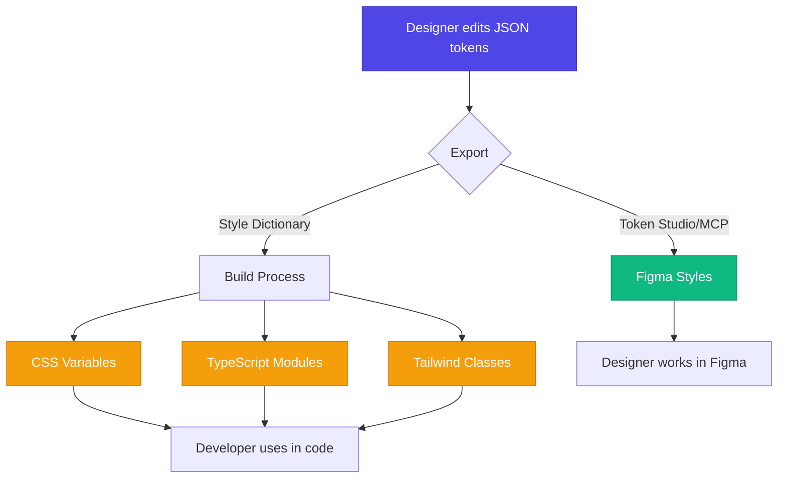

Welcome! If you're reading this, you're probably wondering what a design system is and how Harness uses it. Don't worry — we'll explain everything in plain language, whether you're a designer, developer, or just curious.

## Quick Start

**Just want to start using the design system?** Here's what you need:

**For Developers:**
```bash
# Install and build
pnpm install
cd packages/core-design-system && pnpm build
cd ../ui && pnpm build

# Use in your code
import { Button } from '@harnessio/ui/components'
<Button className="bg-cn-brand-primary">Click me</Button>
```

**For Designers:**
1. Open the [Figma file](#) (ask team for access)
2. Set color profile to **Display P3** (File → Color profile...)
3. Use Token Studio plugin to sync design tokens
4. Start designing with components!

**Want to update tokens?**
- Designers: Edit JSON files in `packages/core-design-system/design-tokens/`
- Export to Figma: Use Token Studio for Figma plugin or [Figma Console MCP](https://github.com/southleft/figma-console-mcp)
- Run: `pnpm build` to generate styles for code
- Code updates automatically, Figma requires manual export!

---

## What is a Design System?

Think of a design system as a **shared language** between designers and developers. Instead of designers saying "make it blue-ish" and developers guessing which blue, we have exact definitions everyone can use.

It's like IKEA instructions for building interfaces — clear, consistent, and repeatable. Once you learn the system, you can build beautiful, accessible interfaces much faster.

## How Harness Design System Works

Our design system has three main parts that work together:

### 1. Design Tokens (The Building Blocks)

**What are they?** Think of design tokens as the DNA of our visual design. They're simple values like:
- Colors: "What exact blue do we use for buttons?"
- Spacing: "How much space goes between elements?"
- Typography: "What font size for headings?"

**Where do they live?** Design tokens are stored as **JSON files** — this is the single source of truth. Designers control these files and can:
- **Export to Figma** — Using Token Studio for Figma plugin or MCP Server
- **Export to code** — Using Style Dictionary script that generates CSS and JavaScript

**Why does this matter?** When a designer updates the JSON tokens, both Figma and code get updated. The designer controls all style configurations in one place. No more "can you make it 2 pixels lighter?" back-and-forth.

### 2. Component Library (The LEGO Pieces)

**What is it?** Pre-built UI components like buttons, inputs, cards, and more. They're built using React and already follow all our design rules.

**Why use them?** Instead of building a button from scratch every time, just grab one from the library. It's already:
- Styled correctly
- Accessible for screen readers
- Works in dark mode
- Tested and ready to use

**For designers:** These components match exactly what you see in Figma.  
**For developers:** They're fully typed with TypeScript and easy to use.

### 3. This Documentation Portal (Your Guide)

**What you're reading right now!** This is your one-stop shop for:
- How to use each component
- Design principles and best practices
- Live examples you can copy
- Code snippets ready to paste

## The Magic: How Design Tokens Flow

Here's the cool part — how design tokens work in both Figma and code.

### Visual Workflow



### The Complete Workflow

**JSON files are the source of truth.** Designers control everything from here:

### Step 1: Designer Edits Tokens

Designer updates JSON files in `packages/core-design-system/design-tokens/`:

**Example: Editing core colors** (`core/colors_lch.json`):
```json
{
  "gray": {
    "25": {
      "$value": "lch(99% 0 272)"
    },
    "50": {
      "$value": "lch(97% 0 272)"
    },
    "100": {
      "$value": "lch(92% 1 272)"
    }
  }
}
```

**Why LCH instead of HEX?** We use the **OKLCH/LCH color space** because it's perceptually uniform — colors that look equally different to humans have equal numeric differences. This makes it much easier to create consistent color scales and accessible contrast ratios.

**What about HEX?** We maintain `colors_hex.json` as a fallback for Figma export, but **LCH is the source of truth** for all color values.

**Example: Editing semantic tokens** (`mode/dark/default.json`):
```json
{
  "bg": {
    "0": {
      "$type": "color",
      "$value": "{pure.black}",
      "$description": "Level 0 background - Page navigation and containers"
    },
    "1": {
      "$type": "color",
      "$value": "{gray.1000}",
      "$description": "Level 1 - Application background"
    }
  },
  "text": {
    "1": {
      "$type": "color",
      "$value": "{gray.25}",
      "$description": "Highest contrast for headings and labels"
    }
  }
}
```

### Step 2: Export to Figma

Designer uses Token Studio for Figma plugin or MCP Server to sync tokens to Figma. This updates:
- Figma color styles
- Figma text styles
- Component properties
- Spacing values

**Important: Set P3 Color Space in Figma**

We use **Display P3** color space for wider color gamut and better color accuracy. Here's how to set it up:

1. Open your Figma file
2. Click on the file name in the top toolbar
3. Select **"Color profile..."** from the dropdown
4. Choose **"Display P3"** instead of "Unmanaged" or "sRGB"

**Why P3?**
- **Wider color gamut** — 25% more colors than sRGB
- **Better for modern displays** — Most devices now support P3
- **Future-proof** — Industry standard for digital design
- **Matches our LCH tokens** — P3 can represent all LCH colors accurately

**Note:** We export HEX values to Figma as a fallback, but with P3 color space enabled, Figma will display colors more accurately and closer to how they appear in modern browsers.

Now designers can work in Figma with real token values and accurate colors!

### Step 3: Build Styles for Code

Developer runs the build command:

```bash
cd packages/core-design-system
pnpm build
```

**What happens automatically:**
- Style Dictionary reads all JSON token files
- Generates CSS custom properties: `--cn-brand-primary: #4F46E5;`
- Generates TypeScript modules for programmatic access
- Creates Tailwind utility classes: `bg-cn-brand-primary`
- Builds all theme variants (light, dark, high-contrast, etc.)

**Output files:**
```
dist/
├── styles/
│   ├── core-imports.css        # Core tokens
│   ├── themes.css              # All theme variants
│   ├── dark-std-std.css        # Dark mode
│   └── light-std-std.css       # Light mode
└── styles-esm/
    ├── index.ts                # TypeScript exports
    └── ...
```

### Step 4: Developers Use Tokens

No manual work needed! Just use the generated classes:

```tsx
// Automatically uses the latest token values
<Button className="bg-cn-brand-primary text-white">
  Click me
</Button>
```

**The magic:** When designer changes the JSON token, developer just runs `pnpm build` again and all styles update automatically. No code changes needed!

**Key point:** Designers control all style configurations through JSON. Developers just build and use the generated styles.

### Organized by Purpose

Tokens are organized in folders by what they do:

- **Colors** — All color palettes (grays, blues, reds, etc.)
- **Spacing** — Gaps, padding, margins
- **Typography** — Font sizes, weights, line heights
- **Components** — Specific values for buttons, inputs, etc.

### Themes Made Easy

We support different visual modes automatically:

- **Light & Dark modes** — For different preferences
- **Contrast levels** — Default, Dimmer, High Contrast
- **Accessibility modes** — Special color palettes for color blindness (Protanopia, Deuteranopia, Tritanopia)

#### Theme Naming Convention

Theme files follow this pattern: `{mode}-{contrast}-{accessibility}.css`

Examples:
- `dark-std-std.css` — Dark mode, Standard contrast, Standard vision
- `light-dimmer-std.css` — Light mode, Dimmer contrast, Standard vision
- `dark-std-protanopia.css` — Dark mode, Standard contrast, Protanopia mode
- `light-high-contrast-std.css` — Light mode, High contrast, Standard vision

#### How to Switch Themes

**In your app:**

```tsx
// Set theme on body element
document.body.className = 'dark-std-std'

// Or use the ThemeSelector component
import { ThemeSelector } from '@harnessio/ui/components'

function App() {
  return (
    <div>
      <ThemeSelector /> {/* Provides theme picker UI */}
      {/* Your app content */}
    </div>
  )
}
```

**What happens automatically:**
- All CSS custom properties update to theme values
- Components re-render with new colors
- No manual color changes needed anywhere!

**Pro tip:** The theme preference is saved to `localStorage` so users' choice persists across sessions.

## Icons & Logos: Always in Sync

Ever had a designer update an icon in Figma, but the code still shows the old version? Not here!

### How Icons Stay Updated

We have a simple command that syncs icons from Figma:

```bash
pnpm update:icons
```

**What happens behind the scenes:**

1. **Connects to Figma** — Grabs all icons from the design file
2. **Downloads them** — Gets fresh SVG files
3. **Optimizes them** — Makes them smaller and faster
4. **Makes them themeable** — Icons automatically match your text color
5. **Updates the code** — Generates a list of all available icons

**The cool part:** Icons automatically change color based on where you use them:

```tsx
<IconV2 name="check" className="text-green-500" />  {/* Green check */}
<IconV2 name="error" className="text-red-500" />    {/* Red error */}
```

No need to export different colored versions — one icon works everywhere!

### Logos Work the Same Way

Same process for logos with `pnpm update:logos`. The difference? Logos keep their brand colors instead of inheriting text color.

## Using Design Tokens in Code

We use Tailwind CSS to make design tokens super easy to use. Think of it as shortcuts for styling.

### Quick Example

Instead of writing CSS like this:

```css
/* The old way - hard to maintain */
.my-button {
  background-color: #4F46E5;
  padding: 12px 24px;
  border-radius: 8px;
}
```

You write this:

```tsx
/* The new way - uses design tokens */
<button className="bg-cn-brand-primary p-cn-md rounded-cn-3">
  Click me
</button>
```

**Why is this better?**
- If the designer changes the primary color, your button updates automatically
- You're guaranteed to use the right values
- Your code is easier to read

### Common Patterns

Here are the most common classes you'll use:

**Backgrounds & Text:**
```tsx
<div className="bg-cn-1 text-cn-2">
  {/* Light background, dark text */}
</div>
```

**Spacing:**
```tsx
<div className="p-cn-md gap-cn-sm mt-cn-lg">
  {/* padding: medium, gap: small, margin-top: large */}
</div>
```

**Colors for Different States:**
```tsx
<Badge className="bg-cn-success-secondary text-cn-success-secondary">
  Success
</Badge>

<Alert className="bg-cn-danger-outline text-cn-danger-outline border-cn-danger-outline">
  Error
</Alert>
```

**Pro tip:** Always use matching background and text colors from the same set. For example, if you use `bg-cn-success-primary`, also use `text-cn-success-primary`.

### Real-World Example: Building a Card Component

Here's how design tokens work in a complete component:

```tsx
import { Button, IconV2 } from '@harnessio/ui/components'

function ProjectCard({ title, status, lastUpdated }) {
  return (
    <div className="bg-cn-2 border border-cn-3 rounded-cn-4 p-cn-lg">
      {/* Header with title */}
      <div className="flex items-center justify-between mb-cn-md">
        <h3 className="text-cn-1 text-cn-size-7 font-semibold">
          {title}
        </h3>
        <IconV2 name="more-vertical" className="text-cn-3" />
      </div>

      {/* Status badge */}
      <div className={`
        inline-flex items-center gap-cn-3xs px-cn-sm py-cn-3xs rounded-cn-3
        ${status === 'success' 
          ? 'bg-cn-success-secondary text-cn-success-secondary' 
          : 'bg-cn-danger-secondary text-cn-danger-secondary'
        }
      `}>
        <IconV2 
          name={status === 'success' ? 'check-circle' : 'alert-circle'} 
          size="xs" 
        />
        {status === 'success' ? 'Active' : 'Failed'}
      </div>

      {/* Footer */}
      <div className="mt-cn-lg pt-cn-md border-t border-cn-3">
        <p className="text-cn-3 text-cn-size-4">
          Updated {lastUpdated}
        </p>
      </div>
    </div>
  )
}
```

**What's happening here:**
- `bg-cn-2` — Card background (automatically adjusts for light/dark mode)
- `border-cn-3` — Subtle border color
- `rounded-cn-4` — Consistent border radius from design tokens
- `p-cn-lg`, `mb-cn-md` — Spacing from the design system
- `text-cn-1`, `text-cn-3` — Text colors with proper hierarchy
- `bg-cn-success-secondary` + `text-cn-success-secondary` — Matching status colors
- Icons inherit text color automatically

**The result:** A component that automatically adapts to all themes, uses consistent spacing, and maintains proper color contrast — all without writing custom CSS!

## Colors That Work for Everyone

Our color system is designed to be beautiful AND accessible.

### What Colors We Have

Think of our colors like a paint palette:

- **Grays** — 14 shades from almost-white to almost-black
- **Brand colors** — Our signature indigo/blue
- **Status colors** — Green for success, red for errors, yellow for warnings
- **Extra colors** — Purple, cyan, mint, orange, pink, and more

### Accessibility Built-In

We make sure everyone can use our interfaces:

**Readable text:** All text meets contrast standards so it's easy to read, even for people with low vision.

**Color blindness support:** We have special color modes for different types of color blindness:
- Red-green color blindness (most common)
- Blue-yellow color blindness (less common)

When you switch to these modes, colors automatically adjust so information isn't lost.

**Why this matters:** About 8% of men and 0.5% of women have some form of color blindness. Our system works for everyone!

## Typography: Clear and Readable

We use two main fonts:

- **Inter** — For all regular text (body, headings, buttons)
- **JetBrains Mono** — For code snippets

### Font Sizes Made Simple

We have a scale from 0 to 16, where bigger numbers = bigger text:

```tsx
<h1 className="text-cn-size-10">Big Heading</h1>
<h2 className="text-cn-size-9">Medium Heading</h2>
<p className="text-cn-size-6">Normal text (this is what you're reading)</p>
<small className="text-cn-size-4">Small text</small>
```

**Tip:** Most body text uses `text-cn-size-6`. Start there and adjust as needed.

## Getting Started (For Developers)

### First Time Setup

```bash
# 1. Install everything
pnpm install

# 2. Build the design system
cd packages/core-design-system
pnpm build

# 3. Build the components
cd packages/ui
pnpm build

# 4. Start the documentation site
cd apps/portal
pnpm dev
```

Now open `http://localhost:...` and you'll see this documentation!

### Common Tasks

**When a designer updates design tokens:**

1. Designer edits JSON files in `packages/core-design-system/design-tokens/`
2. Designer manually exports to Figma:
   - Using Token Studio for Figma plugin (click "Push to Figma")
   - OR using [Figma Console MCP](https://github.com/southleft/figma-console-mcp)
3. Developer runs `pnpm build` to generate new CSS/JS for code
4. Done! Figma styles updated manually, code styles generated automatically

**Important:** Designers own the JSON token files. They control all style configurations. Figma sync is manual, code generation is automatic.

**When icons change:**

```bash
cd packages/ui
pnpm update:icons
```

That's it! Icons are synced from Figma automatically.

**Adding a new component:**

1. Create your component file in `packages/ui/src/components/`
2. Write documentation in `apps/portal/src/content/docs/components/`
3. Add it to the sidebar menu

We'll guide you through each step in the component documentation.

## How the Code is Organized

Here's where everything lives:

```
canary/
├── packages/
│   ├── core-design-system/    # The design tokens (colors, spacing, etc.)
│   └── ui/                     # All the React components
│
└── apps/
    └── portal/                 # This documentation site
```

**For designers:** You control the JSON token files in `core-design-system/design-tokens/`. From there, you export to both Figma (via Token Studio or MCP Server) and to code (via Style Dictionary).

**For developers:** You work in the `ui` package, using the generated styles and components. You consume what designers configure in the tokens.

## Common Issues & Troubleshooting

Running into problems? Here are solutions to the most common issues:

### Build Fails

**Problem:** `pnpm build` fails in `core-design-system`

**Solutions:**
```bash
# 1. Clear node_modules and reinstall
rm -rf node_modules
pnpm install

# 2. Clear build cache
rm -rf dist
pnpm build

# 3. Check for JSON syntax errors in token files
# Look for missing commas, quotes, or brackets
```

### Tokens Not Updating in Code

**Problem:** Changed tokens in JSON but code still shows old values

**Solutions:**
1. Make sure you ran `pnpm build` in `core-design-system`
2. Restart your dev server
3. Clear browser cache (hard refresh: Cmd+Shift+R)
4. Check if you're importing from the right package: `@harnessio/core-design-system`

### Tokens Not Syncing to Figma

**Problem:** Token Studio plugin not updating Figma styles

**Solutions:**
1. Check Token Studio plugin is installed and active
2. Verify you're using the correct token set in the plugin
3. Click "Push to Figma" in Token Studio settings
4. Make sure Figma file has correct permissions (not view-only)

### Icons Not Showing

**Problem:** `<IconV2 name="..." />` renders nothing

**Solutions:**
```bash
# 1. Rebuild icons
cd packages/ui
pnpm update:icons

# 2. Check icon name is correct
# Icons use kebab-case: "check-circle" not "checkCircle"

# 3. Verify import
import { IconV2 } from '@harnessio/ui/components'
```

### Theme Not Switching

**Problem:** Theme class changes but colors don't update

**Solutions:**
1. Verify theme CSS is imported in your app
2. Check theme class is on `<body>` element, not a child
3. Make sure you're using CSS custom properties, not hardcoded colors
4. Clear browser cache and restart dev server

### TypeScript Errors

**Problem:** TypeScript can't find types for components

**Solutions:**
```bash
# 1. Rebuild UI package
cd packages/ui
pnpm build

# 2. Check tsconfig.json includes the right paths
# 3. Restart TypeScript server in your IDE
```

**Still stuck?** Check our [GitHub Issues](https://github.com/harness/canary/issues) or ask the team!

## Contributing to the Design System

Want to improve the design system? We welcome contributions! Here's how:

### Adding a New Design Token

**For Designers:**

1. **Edit the JSON file** in `packages/core-design-system/design-tokens/`
   - Core colors: `core/colors_lch.json`
   - Semantic tokens: `mode/dark/default.json` or `mode/light/default.json`
   - Typography: `core/typography.json`
   - Spacing: `core/dimensions.json`

2. **Follow naming conventions:**
   - Use semantic names: `bg-1`, `text-primary`, not `gray-100`
   - Include `$description` to explain usage
   - Use LCH color space for colors

3. **Test in both Figma and code:**
   - Export to Figma via Token Studio
   - Run `pnpm build` to generate styles
   - Verify in both environments

4. **Submit a PR** with clear description of the new token and its use case

### Adding a New Component

**For Developers:**

1. **Create component** in `packages/ui/src/components/your-component/`
   ```tsx
   // Use design tokens, not hardcoded values
   import { cn } from '@harnessio/ui/utils'
   
   export function YourComponent({ className, ...props }) {
     return (
       <div className={cn('bg-cn-2 p-cn-md rounded-cn-3', className)}>
         {/* Component content */}
       </div>
     )
   }
   ```

2. **Export from index** in `packages/ui/src/components/index.ts`

3. **Write documentation** in `apps/portal/src/content/docs/components/your-component.mdx`
   - Include usage examples
   - Show all variants
   - Document props

4. **Add to sidebar** in `apps/portal/astro.config.ts`

5. **Submit a PR** with component, docs, and examples

### Proposing Changes

**Before making big changes:**

1. Open a GitHub Discussion or Issue
2. Describe the problem you're solving
3. Propose your solution
4. Get feedback from the team
5. Implement after approval

### Code Review Process

All contributions go through review:

- **Design tokens:** Reviewed by design team
- **Components:** Reviewed by engineering + design
- **Documentation:** Reviewed by technical writers

**Review criteria:**
- ✅ Follows design system principles
- ✅ Uses tokens, not hardcoded values
- ✅ Accessible (WCAG 2.1 AA)
- ✅ Works in all themes
- ✅ Documented with examples
- ✅ TypeScript types included

## Why This Approach Works

### 1. One Source of Truth

**JSON design tokens** are the single source of truth. Designers control these files, and both Figma and code are generated from them. No more "is this the right blue?" questions — everyone uses the exact same values.

### 2. Designer Controls Everything

Designers edit JSON tokens and export to both Figma and code. All style configurations (colors, spacing, typography) are managed by designers through these token files. Developers just consume the generated styles.

### 3. Consistency by Default

When you use the system, your UI automatically looks consistent. You can't accidentally use the wrong spacing or color.

### 4. Accessible by Default

All our colors, components, and patterns are tested for accessibility. You don't have to be an accessibility expert — it's built in.

### 5. Faster Development

Instead of writing CSS from scratch, use pre-built components and utility classes. Build UIs in minutes, not hours.

## Performance & Optimization

The design system is built with performance in mind:

### Bundle Size

**CSS Output:**
- Core tokens: ~15KB (gzipped)
- Single theme: ~8KB (gzipped)
- Total for one theme: ~23KB (gzipped)

**Tree-Shaking:**
- Only import components you use
- Unused Tailwind classes are purged automatically
- CSS custom properties enable runtime theming without duplicating styles

**Best Practices:**

```tsx
// ✅ Good - Import only what you need
import { Button, Input } from '@harnessio/ui/components'

// ❌ Avoid - Imports everything
import * as UI from '@harnessio/ui'
```

### Runtime Performance

**CSS Custom Properties are fast:**
- Theme switching is instant (just change one class)
- No JavaScript required for theming
- Browser-native, highly optimized

**Component Performance:**
- All components are memoized where appropriate
- Icons are SVG (small, scalable, cacheable)
- No runtime CSS-in-JS overhead

### Loading Strategy

**Recommended approach:**

```tsx
// 1. Load core styles in <head>
import '@harnessio/core-design-system/core-styles'

// 2. Load theme CSS (only one theme at a time)
import '@harnessio/core-design-system/themes' // All themes
// OR
import '@harnessio/core-design-system/dark-std-std.css' // Specific theme

// 3. Components load on-demand via code splitting
const HeavyComponent = lazy(() => import('./HeavyComponent'))
```

**Result:** Fast initial load, instant theme switching, optimal bundle size!

## What's Next?

Ready to dive deeper? Here are some good next steps:

**For Designers:**
- [Color System](/foundations/colors) — See all available colors
- [Typography](/foundations/typography) — Font sizes and styles
- [Icons](/foundations/icons) — Browse all icons

**For Developers:**
- [Installation](/getting-started/installation) — Set up your project
- [Components](/components/button) — Browse all components
- [Layout System](/foundations/layout) — Learn about spacing and layout

**Questions?** Check out our [GitHub repository](https://github.com/harness/canary) or ask the team!

---

## Glossary

Key terms used throughout the design system:

**Design Tokens**
: Atomic values (colors, spacing, typography) stored as JSON that define the visual properties of the system. The single source of truth for all styles.

**LCH / OKLCH**
: A perceptually uniform color space where equal numeric differences represent equal visual differences. Makes it easier to create consistent color scales.

**Display P3**
: A wide color gamut color space with 25% more colors than sRGB. Used in Figma for accurate color representation.

**Style Dictionary**
: Build tool that transforms design tokens from JSON into multiple output formats (CSS, JavaScript, etc.).

**Token Studio**
: Figma plugin that syncs design tokens between JSON files and Figma styles.

**Semantic Tokens**
: Tokens that describe purpose rather than appearance (e.g., `bg-1` instead of `gray-100`).

**Theme Variants**
: Different visual modes combining mode (light/dark), contrast level, and accessibility settings.

**CSS Custom Properties**
: Browser-native CSS variables (e.g., `--cn-bg-1`) that enable runtime theming without duplicating styles.

**Tree-Shaking**
: Build optimization that removes unused code from the final bundle.

**Component Props**
: TypeScript-typed properties that control component behavior and appearance.

**Tailwind Utilities**
: Pre-generated CSS classes that map to design tokens (e.g., `bg-cn-brand-primary`).

---

**Remember:** The design system is here to help you, not restrict you. If something doesn't work for your use case, let us know. We're always improving!
