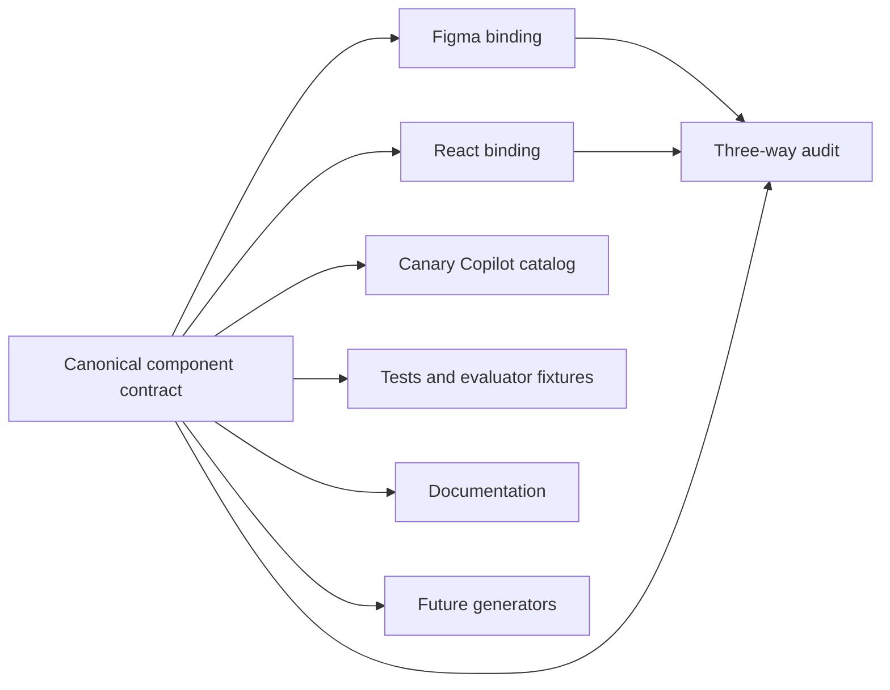
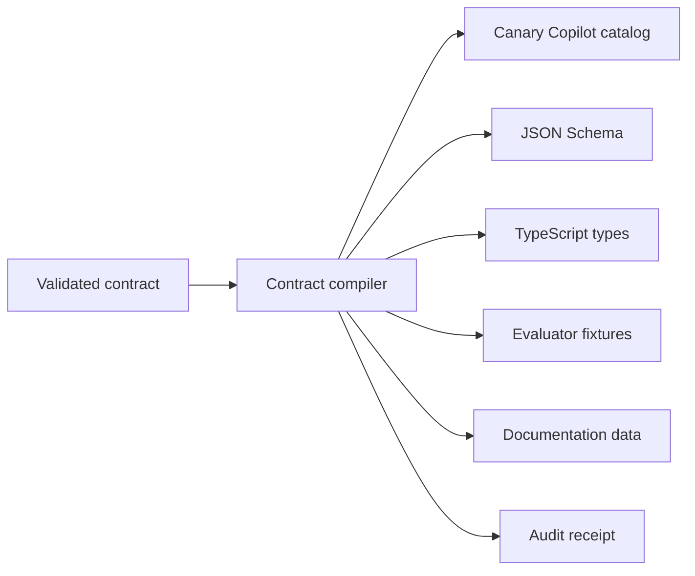

# Generation-Ready Canary Component Contracts

**Date:** 2026-08-14  
**Status:** Approved design, pending implementation plan  
**Initial pilot:** Button  
**Target schema:** 0.4.0

## Summary

Canary component contracts will become the central, machine-readable definition of a component. Figma and React will be treated as implementations of that definition rather than surfaces that synchronize directly with one another.

The schema will be generation-ready now, but the first implementation will remain verification-first. It will generate low-risk artifacts such as the Canary Copilot catalog, JSON Schema, TypeScript types, evaluator fixtures, documentation data, and deterministic audit receipts. Production React and Figma generation will wait until the schema has been proven across five meaningfully different pilot components.

This boundary avoids redesigning the schema when generation begins without allowing an immature generator to overwrite production artifacts.

## Goals

- Define one portable, canonical model for component meaning, anatomy, properties, states, constraints, tokens, and accessibility.
- Bind that canonical model explicitly to Figma and React.
- Make supported, deprecated, and unsupported combinations executable.
- Distinguish automatically verified rules from manual and advisory guidance.
- Produce deterministic evidence of contract, Figma, code, and cross-surface health.
- Add transparent component-health scoring without weakening blocking findings.
- Preserve Canary-specific governance, lifecycle, evidence, and migration context.
- Establish stable inputs for future code, Figma, Code Connect, documentation, test, and agent-context generation.

## Non-goals for the first implementation

- Generating or overwriting the production Button React component.
- Generating or overwriting the published Button Figma component sets.
- Replacing human review, accessibility testing, or design-system governance.
- Producing organization- or team-level scoreboards.
- Treating a numeric score as a substitute for individual findings.
- Making unresolved proposals operative contract rules.

## Architecture

The contract is the authority. Figma and React map to it independently.



The authoring model has three layers.

### 1. Canonical component model

Portable facts that should remain true regardless of implementation surface:

- Identity and semantics.
- Properties, values, defaults, and constraints.
- Anatomy, slots, and composition.
- States and state transitions.
- Layout relationships and token references.
- Accessibility requirements.
- Supported, deprecated, and unsupported combinations.

### 2. Surface bindings

Surface-specific representations of the canonical model:

- Figma component keys, component-set identities, properties, aliases, and transformations.
- React package, export, prop names, types, aliases, and transformations.
- Intentional design-only or code-only capabilities.
- Fidelity limits where a surface cannot express the canonical behavior directly.

### 3. Governance

Rules for safely operating and evolving the contract:

- Lifecycle and ownership.
- Evidence and verification dates.
- Deprecation and migration guidance.
- Automated, manual, and advisory enforcement.
- Contract and schema versioning.

Unresolved proposals belong in Jira, Confluence, or architecture decisions. They do not become effective contract rules until approved.

## Schema 0.4.0

### Top-level model

| Field | Purpose |
| --- | --- |
| `schemaVersion` | Version of the contract format. |
| `contractVersion` | Version of the component's approved rules. |
| `identity` | Stable component ID, name, summary, and aliases. |
| `semantics` | Purpose, semantic roles, and intended meaning. |
| `lifecycle` | Maturity, publication, deprecation, and replacement status. |
| `ownership` | Responsible team and review contacts. |
| `anatomy` | Structured parts, hierarchy, slots, and composition rules. |
| `properties` | Typed canonical properties and their surface bindings. |
| `states` | Supported states and their representation on each surface. |
| `constraints` | Allowed, deprecated, and unsupported combinations. |
| `tokens` | Token references by part, state, and visual channel. |
| `accessibility` | Semantic, keyboard, labeling, and assistive-technology rules. |
| `usage` | Structured guidance, patterns, and anti-patterns. |
| `surfaces` | Figma libraries/keys and React packages/exports. |
| `requirements` | Auditable rules with dimension, severity, and enforcement. |
| `migrations` | Replacement guidance for deprecated capabilities. |
| `evidence` | Verification sources, dates, versions, and results. |

### Canonical properties

Properties will be authored once. The current `shared`, `designOnly`, and `codeOnly` groupings will be removed. Those classifications will be derived from binding presence.

```json
{
  "id": "variant",
  "label": "Variant",
  "description": "Communicates the action hierarchy.",
  "type": "enum",
  "default": "primary",
  "values": ["primary", "secondary", "link"],
  "required": false,
  "bindings": {
    "figma": {
      "property": "variant",
      "valueAliases": {}
    },
    "react": {
      "prop": "variant",
      "type": "ButtonProps['variant']"
    }
  }
}
```

A property with only a Figma binding is design-only. A property with only a React binding is code-only. A property with both is shared, even when aliases or transformations differ.

### Anatomy

Anatomy will move from descriptive prose to structured parts. Each part can declare:

- Stable ID and semantic role.
- Required, optional, conditional, or repeated presence.
- Parent/child relationships.
- Supported content or component types.
- Property-controlled visibility.
- Layout relationship.
- Token channels.
- Figma layer and React slot bindings.

This structure supports verification now and future component generation later.

### States

States will be declared once and bound to each surface. A state can declare:

- Stable ID and description.
- Trigger or transition.
- Whether it is interactive, persistent, or transient.
- Property or pseudo-class representation by surface.
- State-specific token overrides.
- Accessibility behavior.
- Fidelity limits.

For Button, `focus-visible` remains an intentional code-only interactive state with a representative Figma specification rather than a required Figma variant.

### Constraints

The current Button support matrix will become executable constraints. Each rule will include:

- Stable ID.
- Match conditions over canonical properties.
- Status: `supported`, `deprecated`, or `unsupported`.
- Reason.
- Optional migration reference.
- Optional requirement reference.

The compiler will reject ambiguous rules. The evaluator must resolve every auditable combination to exactly one rule. No match or multiple matches is a contract error, not an implicit pass.

### Tokens

Token rules will use token references associated with anatomy, state, and visual channel instead of prose-only descriptions. A token binding identifies:

- Anatomy part.
- Channel such as background, foreground, border, radius, spacing, or focus ring.
- Canonical token reference.
- Optional state or property condition.
- Surface binding or transformation when needed.

### Requirements

Every auditable requirement will declare:

```json
{
  "id": "button.supported-combination",
  "dimension": "figmaImplementation",
  "severity": "critical",
  "enforcement": "automated",
  "statement": "Button instances must use a supported property combination."
}
```

Supported enforcement modes are:

- `automated`: Canary tooling can evaluate the rule deterministically.
- `manual`: A human review is required and the requirement must not be counted as automatically passing.
- `advisory`: Guidance is shown but does not affect compliance.

Supported severity levels are:

- `critical`: Failure blocks approval regardless of score.
- `major`: Material health deduction and actionable finding.
- `minor`: Limited health deduction and actionable finding.
- `informational`: No compliance deduction.

## Compilation

The validated source contract will be compiled into consumer-specific artifacts.



The compiler, not individual consumers, will normalize aliases, derive shared/design-only/code-only classifications, and validate cross-references. Generated artifacts must include their schema version, contract version, source identity, and generation metadata.

The JSON Schema and TypeScript types are generated artifacts. The existing runtime Zod schema remains the implementation authority for the first migration to minimize disruption. A later architecture decision may reverse that direction if schema-first generation proves more maintainable.

## Canary Copilot evaluation

For each selected component, Canary Copilot will:

1. Match stable published component keys.
2. Normalize property names and values through Figma bindings.
3. Derive canonical values encoded in component-set identity when needed.
4. Build one canonical representation of the instance.
5. Validate individual values and evaluate the complete combination.
6. Inspect contract-declared anatomy and automated requirements.
7. Identify manual and advisory requirements explicitly.
8. Return remediation guidance from the contract.

Nested implementation components such as prefix and suffix icons will not be reported as uncatalogued top-level components unless their contracts explicitly declare independent auditing.

### Finding classification

| Result | Meaning |
| --- | --- |
| `fail` | An approved, automatically verifiable rule was violated. |
| `warn` | A capability is deprecated or needs attention but remains temporarily valid. |
| `info` | An intentional surface difference, manual requirement, or advisory rule. |
| `pass` | All applicable automated checks passed. |
| `notInCatalog` | The selected top-level component has no known contract identity. |

Detached or copied components that impersonate Canary remain failures because their library identity cannot be verified.

## Component-health scoring

Scoring complements findings; it never replaces them.

### Health dimensions

The first evaluation profile will score:

- Contract definition.
- Figma implementation.
- Code implementation.
- Design/code parity.
- Governance and evidence.

Weights and thresholds live in one centrally versioned evaluation profile. Component authors do not set their own scoring weights.

The initial profile uses these dimension weights:

| Dimension | Weight |
| --- | ---: |
| Contract definition | 20% |
| Figma implementation | 25% |
| Code implementation | 25% |
| Design/code parity | 20% |
| Governance and evidence | 10% |

Within a dimension, non-advisory requirements use centrally defined severity weights: `critical` = 8, `major` = 3, and `minor` = 1. Passed automated checks and current, evidenced manual checks earn their weight. Failed, unavailable, stale, or unevaluated checks remain unearned. Informational and advisory requirements do not affect the score.

Health status thresholds are:

- `healthy`: 90–100 with no critical failures.
- `needsAttention`: 70–89 with no critical failures.
- `atRisk`: 0–69 with no critical failures.
- `blocked`: any critical failure, regardless of score.

The result reports both evaluation coverage and automation coverage so a high score cannot hide a small evaluated sample.

### Derived result

```text
Button health: 86/100 — Needs attention
Blockers: 0
Automated coverage: 72%
Evaluation coverage: 91%

Contract definition       100
Figma implementation       84
Code implementation        94
Design/code parity         78
Governance and evidence     70
```

The score is derived from current findings and evidence and is never authored into the contract.

### Scoring safeguards

- Critical failures set the health status to `blocked` regardless of numeric score.
- Manual and unavailable checks do not count as passing.
- Every score includes automated coverage and evidence freshness.
- Dimension scores remain visible; the total is not opaque.
- Findings and remediation remain the primary practitioner workflow.
- Selected instances keep pass/warn/fail results. The broader catalog component receives the health score.
- Library-wide dashboards, trends, rankings, and team comparisons are deferred.

## Three-way drift detection

The canonical model will compare:

- The approved contract.
- The published Figma component.
- The exported React API.

The resulting receipt will distinguish:

- All three agree.
- Figma differs.
- Code differs.
- Both implementations differ.
- The difference is intentional and documented.
- The requirement cannot yet be verified automatically.

The first implementation establishes the interfaces and deterministic receipt format. Button contract and code validation plus live Figma evaluation provide the first vertical slice. Generic production extraction and generation expand after the pilot set validates the model.

## Button migration

Button will be migrated from schema 0.3.0 to 0.4.0 without reopening approved policy decisions.

The migration will:

- Normalize properties and surface bindings.
- Convert the approved support matrix to constraints.
- Preserve supported AI, transparent, icon-only, and rounded icon-only combinations accurately.
- Preserve rounded text deprecation and migration guidance.
- Preserve Button-versus-Link semantic guidance, including the onboarding-flow exception.
- Preserve focus-visible as intentional code-only behavior.
- Remove resolved questions and provisional fields from the effective contract.
- Preserve verified Figma keys, Code Connect identities, publication evidence, and ownership.
- Advance contract version independently from schema version.

The migration must demonstrate semantic equivalence for approved rules before the old representation is removed.

## Rollout

### Phase 1: Schema and Button vertical slice

- Add schema 0.4.0 runtime validation.
- Generate JSON Schema and TypeScript types.
- Migrate Button.
- Compile the Canary Copilot catalog.
- Evaluate Button constraints and health.
- Produce deterministic test fixtures and audit receipts.

### Phase 2: Pilot expansion

Migrate four additional components chosen to stress different contract capabilities:

- A form control with validation and accessibility behavior.
- A composite or slotted component.
- A stateful interactive component.
- A layout or content-oriented component.

The exact components will be selected during pilot planning based on current inventory maturity and available owners.

### Phase 3: Generation decision

After five pilots, review whether the canonical model can generate without surface-specific leakage or manual patching. If it can, add renderers incrementally, starting with the lowest-risk artifact. Production React and Figma generation each require a separate approval and migration strategy.

## Testing and acceptance

Implementation follows test-driven development for new evaluation behavior.

Required verification includes:

- Schema accepts complete valid contracts and rejects invalid cross-references.
- Schema rejects ambiguous or non-exhaustive constraints where exhaustive evaluation is required.
- Button contract preserves all approved combinations and deprecations.
- Compiler output is deterministic.
- Generated schema/types/catalog/docs data remain in sync.
- Canary Copilot matches all verified Button identities.
- Nested implementation icons do not become false uncatalogued findings.
- Supported combinations pass.
- Deprecated combinations warn with migration guidance.
- Unsupported combinations fail.
- Intentional code-only and design-only behavior is informational.
- Health scores, dimension scores, blockers, coverage, and freshness are reproducible.
- A critical failure blocks health regardless of total score.
- Manual checks never inflate automated coverage.
- Contract validation, plugin tests, plugin build, UI package checks, and Code Connect validation pass.
- The published Button library is re-audited and evidence is recorded.

## Documentation

A new Confluence page, **Canary Component Contract Schema Specification**, will be created in the existing AI-ready design-system documentation folder.

It will contain:

- The contract architecture and diagrams.
- Every top-level and nested schema field.
- Type, required status, allowed values, default, owner, consumer, and example.
- Enforcement behavior in Canary Copilot and CI.
- Versioning and migration rules.
- A complete Button example.
- Component-health scoring and coverage semantics.
- Cross-links to the strategy, authoring guide, pilot plan, Button gap-closure plan, overview, and current-status pages.

Field-reference tables will be generated from the validated schema. Explanations, examples, and workflow guidance will be human-authored.

Existing Confluence pages will be fetched immediately before each update. Changes will be surgical so concurrent edits and existing content are preserved.

## Governance

- Schema changes require semantic versioning and an architecture decision for breaking changes.
- Contract changes require an owner, evidence, and an independently versioned contract version.
- Generated artifacts are never hand-edited.
- CI detects stale generated artifacts.
- A component cannot advance lifecycle status based on unevaluated prose.
- Exceptions require an explicit decision, owner, reason, and review date.
- Deprecations require migration guidance and evidence that every surface communicates the same status.

## Success criteria

The first implementation is complete when:

- Button validates against schema 0.4.0.
- Canary Copilot evaluates Button combinations, anatomy, and intentional differences from compiled contract data.
- Button receives a transparent component-health score with dimension breakdown, blockers, coverage, and evidence freshness.
- JSON Schema, TypeScript types, evaluator fixtures, documentation data, and audit receipts are generated deterministically.
- Contract, plugin, Code Connect, and Button audit checks pass.
- The schema specification and related Confluence pages are current and cross-linked.
- No production React or Figma artifact is regenerated without a separate approved decision.
