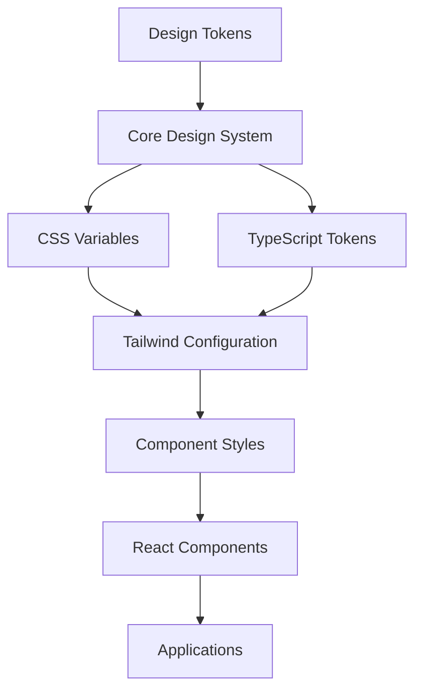

# Design System Integration in UI Package

This document explains how the `@harnessio/core-design-system` is integrated and utilized within the `@harnessio/ui` package to create consistent, themeable, and scalable React components.

## Table of Contents

- [Integration Overview](#integration-overview)
- [CSS Integration](#css-integration)
- [Tailwind CSS Integration](#tailwind-css-integration)
- [Component Implementation Patterns](#component-implementation-patterns)
- [Token Usage in Components](#token-usage-in-components)
- [Build System Integration](#build-system-integration)
- [Theme System](#theme-system)
- [Best Practices](#best-practices)

## Integration Overview

The UI package serves as the **consumption layer** for the core design system, transforming design tokens into production-ready React components. The integration follows a **multi-layered approach**:



### Key Integration Points

1. **CSS Variable Import**: Direct import of design system CSS variables
2. **Tailwind Configuration**: Custom Tailwind config that maps design tokens to utility classes
3. **Component Styling**: Components use both CSS classes and Tailwind utilities
4. **TypeScript Integration**: Type-safe access to design tokens in JavaScript/TypeScript

## CSS Integration

### Main Stylesheet Import

The UI package imports the core design system CSS in its main stylesheet:

```css
/* packages/ui/src/styles/styles.css */
@import url('@harnessio/core-design-system/core-styles');
@import url('@harnessio/core-design-system/themes');
@import url('@harnessio/core-design-system/mfe-themes');
```

This provides:
- **Core CSS Variables**: All design tokens as CSS custom properties
- **Theme Definitions**: Light/dark and accessibility theme variants
- **MFE Support**: Micro-frontend specific theme utilities

### CSS Variable Usage Pattern

Components can directly use CSS variables from the design system:

```css
.my-component {
  background-color: var(--cn-color-primary-base);
  color: var(--cn-color-primary-contrast);
  padding: var(--cn-spacing-3) var(--cn-spacing-4);
  border-radius: var(--cn-border-radius-md);
}
```

## Tailwind CSS Integration

### Custom Tailwind Configuration

The UI package extends Tailwind CSS with design system tokens through `tailwind-design-system.ts`:

```typescript
// packages/ui/tailwind-design-system.ts
export default {
  theme: {
    extend: {
      // Size tokens mapped to Tailwind utilities
      size: {
        'cn-0': 'var(--cn-size-0)',
        'cn-1': 'var(--cn-size-1)',
        'cn-2': 'var(--cn-size-2)',
        // ... all size tokens
      },
      
      // Color tokens mapped to Tailwind color utilities
      backgroundColor: {
        'cn-1': 'lch(from var(--cn-bg-1) l c h / <alpha-value>)',
        'cn-2': 'lch(from var(--cn-bg-2) l c h / <alpha-value>)',
        // ... all background colors
      },
      
      // Text color tokens
      textColor: {
        'cn-1': 'lch(from var(--cn-text-1) l c h / <alpha-value>)',
        'cn-2': 'lch(from var(--cn-text-2) l c h / <alpha-value>)',
        // ... all text colors
      }
    }
  }
}
```

### Token-to-Utility Mapping

Design tokens are systematically mapped to Tailwind utilities:

| Design Token | Tailwind Class | Usage |
|--------------|----------------|-------|
| `--cn-size-4` | `w-cn-4`, `h-cn-4` | Width/height utilities |
| `--cn-bg-1` | `bg-cn-1` | Background color |
| `--cn-text-1` | `text-cn-1` | Text color |
| `--cn-border-2` | `border-cn-2` | Border color |
| `--cn-spacing-3` | `p-cn-3`, `m-cn-3` | Padding/margin |

### Component-Specific Utilities

The system generates component-specific Tailwind utilities:

```typescript
// Automatic hover class generation
const hoverClasses = {
  '.hover\\:bg-cn-primary:hover': {
    'background-color': 'var(--cn-color-primary-hover)'
  }
}
```

## Component Implementation Patterns

### 1. CSS Class-Based Components

Components use predefined CSS classes that reference design tokens:

```typescript
// Button component using CSS classes
const buttonVariants = cva('cn-button', {
  variants: {
    variant: {
      primary: 'cn-button-primary',
      secondary: 'cn-button-secondary',
      outline: 'cn-button-outline'
    },
    size: {
      sm: 'cn-button-sm',
      md: '', // default
      lg: 'cn-button-lg'
    }
  }
})
```

The corresponding CSS classes are defined in `tailwind-utils-config/components/button.ts`:

```typescript
// CSS class definitions using design tokens
const buttonStyles = {
  '.cn-button': {
    display: 'inline-flex',
    alignItems: 'center',
    justifyContent: 'center',
    borderRadius: 'var(--cn-border-radius-md)',
    fontSize: 'var(--cn-typography-body-sm-font-size)',
    fontWeight: 'var(--cn-typography-body-sm-font-weight)',
    transition: 'var(--cn-transition-colors)'
  },
  
  '.cn-button-primary': {
    backgroundColor: 'var(--cn-set-brand-primary-bg)',
    color: 'var(--cn-set-brand-primary-text)',
    borderColor: 'var(--cn-set-brand-primary-border)'
  }
}
```

### 2. Tailwind Utility-Based Components

Some components use Tailwind utilities directly:

```typescript
// Input component using Tailwind utilities
const Input = forwardRef<HTMLInputElement, InputProps>(({ className, ...props }, ref) => {
  return (
    <input
      className={cn(
        'bg-cn-2 px-3 py-1 text-cn-1', // Design system utilities
        'disabled:cursor-not-allowed disabled:bg-cn-3 disabled:text-cn-3',
        'border-cn-2 focus-within:border-cn-1',
        className
      )}
      ref={ref}
      {...props}
    />
  )
})
```

### 3. Hybrid Approach

Many components combine both approaches:

```typescript
// File Explorer using both CSS classes and Tailwind utilities
const FileExplorer = () => {
  return (
    <div className={cn(
      'cn-file-tree-item', // CSS class from design system
      'hover:bg-cn-hover', // Tailwind utility
      isActive && 'cn-file-tree-item-active' // Conditional CSS class
    )}>
      {/* Component content */}
    </div>
  )
}
```

## Token Usage in Components

### ❌ Anti-Pattern: Direct CSS Variable Usage

**DO NOT** use CSS variables directly in React components. This is considered an anti-pattern:

```typescript
// ❌ WRONG - Direct CSS variable usage in component
const ProgressBar = ({ value }: { value: number }) => {
  return (
    <div 
      style={{
        backgroundColor: 'var(--cn-color-background-secondary)', // ❌ Anti-pattern
        borderRadius: 'var(--cn-border-radius-sm)'                // ❌ Anti-pattern
      }}
    >
      {/* Component content */}
    </div>
  )
}
```

### ✅ Correct Approach: Style File Definition

**ALWAYS** define component styles in their respective files in `tailwind-utils-config/components/[COMPONENT].ts`:

```typescript
// ✅ CORRECT - Define styles in tailwind-utils-config/components/progress.ts
const progressStyles = {
  '.cn-progress-bar': {
    backgroundColor: 'var(--cn-color-background-secondary)',
    borderRadius: 'var(--cn-border-radius-sm)',
    position: 'relative',
    overflow: 'hidden'
  },
  
  '.cn-progress-fill': {
    backgroundColor: 'var(--cn-color-primary-base)',
    height: '100%',
    transition: 'width 0.3s ease'
  }
}

// ✅ CORRECT - Use CSS classes in component
const ProgressBar = ({ value }: { value: number }) => {
  return (
    <div className="cn-progress-bar">
      <div 
        className="cn-progress-fill"
        style={{ width: `${value}%` }} // Only dynamic values in style prop
      />
    </div>
  )
}
```

### Style File Organization

Component styles should be organized in dedicated files:

```typescript
// tailwind-utils-config/components/progress.ts
import { CSSRuleObject } from 'tailwindcss/types/config'

export const progressStyles: CSSRuleObject = {
  // Base component styles
  '.cn-progress': {
    backgroundColor: 'var(--cn-color-background-secondary)',
    borderRadius: 'var(--cn-border-radius-md)',
    overflow: 'hidden',
    position: 'relative'
  },
  
  // Component variants
  '.cn-progress-sm': {
    height: 'var(--cn-size-2)'
  },
  
  '.cn-progress-md': {
    height: 'var(--cn-size-3)'
  },
  
  // Component states
  '.cn-progress-fill': {
    backgroundColor: 'var(--cn-color-primary-base)',
    height: '100%',
    transition: 'var(--cn-transition-all)'
  },
  
  '.cn-progress-fill-success': {
    backgroundColor: 'var(--cn-color-success-base)'
  }
}
```

### Semantic Token Usage

Components use semantic tokens that automatically adapt to themes:

```typescript
// Text component with semantic color variants
const textVariants = cva('', {
  variants: {
    color: {
      'foreground-1': 'text-cn-1',    // Primary text
      'foreground-2': 'text-cn-2',    // Secondary text  
      'foreground-3': 'text-cn-3',    // Tertiary text
      'success': 'text-cn-success',   // Success state
      'danger': 'text-cn-danger',     // Error state
      'warning': 'text-cn-warning'    // Warning state
    }
  }
})
```

### Component-Specific Tokens

Some components use specialized tokens designed for their specific use cases:

```typescript
// Input component using input-specific tokens
const inputVariants = cva('cn-input-container', {
  variants: {
    variant: {
      danger: 'cn-input-danger',     // Uses --cn-input-danger-* tokens
      warning: 'cn-input-warning',   // Uses --cn-input-warning-* tokens
      success: 'cn-input-success'    // Uses --cn-input-success-* tokens
    }
  }
})
```

## Build System Integration

### Component Style Generation

The build system processes component styles through multiple layers:

1. **Design Token Processing**: Core design system generates CSS variables
2. **Tailwind Processing**: Custom configuration maps tokens to utilities
3. **Component Compilation**: CSS classes and utilities are processed
4. **Bundle Generation**: Final CSS bundle includes all styles

### Dependency Chain

```bash
# Build order ensures proper token availability
1. @harnessio/core-design-system → CSS variables + TypeScript tokens
2. @harnessio/ui → Tailwind config + Component styles
3. Applications → Final CSS bundle
```

### Hot Module Replacement (HMR)

The development setup supports HMR for design system changes:

```typescript
// vite.config.ts - Watches design system changes
export default {
  server: {
    watch: {
      // Watch design system files for changes
      ignored: ['!**/packages/core-design-system/**']
    }
  }
}
```

## Theme System

### Theme Switching

Components automatically respond to theme changes through CSS variables:

```html
<!-- Light theme (default) -->
<html>
  <body>
    <!-- Components use light theme tokens -->
  </body>
</html>

<!-- Dark theme -->
<html data-theme="dark">
  <body>
    <!-- Components automatically use dark theme tokens -->
  </body>
</html>
```

### Accessibility Themes

The system supports accessibility variants:

```html
<!-- High contrast theme -->
<html data-theme="dark-high-contrast">
  <body>
    <!-- Components use high contrast token values -->
  </body>
</html>

<!-- Color vision deficiency support -->
<html data-theme="light-protanopia">
  <body>
    <!-- Components use protanopia-safe colors -->
  </body>
</html>
```

### Runtime Theme Switching

Themes can be switched at runtime without component re-renders:

```typescript
// Theme switching utility
const switchTheme = (theme: string) => {
  document.documentElement.setAttribute('data-theme', theme)
  // All components automatically update via CSS variables
}
```

## Best Practices

### 1. Always Define Styles in Style Files

```typescript
// ✅ CORRECT - Define styles in tailwind-utils-config/components/
// tailwind-utils-config/components/my-component.ts
export const myComponentStyles = {
  '.cn-my-component': {
    backgroundColor: 'var(--cn-color-background-primary)',
    padding: 'var(--cn-spacing-4)'
  }
}

// ✅ CORRECT - Use CSS classes in component
className="cn-my-component"

// ❌ WRONG - Direct CSS variables in component
style={{
  backgroundColor: 'var(--cn-color-background-primary)',
  padding: 'var(--cn-spacing-4)'
}}
```

### 2. Use Component-Specific CSS Classes

```typescript
// ✅ Best - Uses component-specific CSS class
className="cn-button-primary"

// ⚠️ Acceptable - Uses design system utilities (only when necessary)
className="bg-cn-brand-primary text-cn-brand-primary-contrast"

// ❌ Avoid - Direct Tailwind classes without design system tokens
className="bg-blue-500 text-white"
```

### 3. Prefer Semantic Tokens

```typescript
// ✅ Good - Uses semantic tokens in style files
'.cn-component': {
  backgroundColor: 'var(--cn-color-primary-base)', // semantic
  color: 'var(--cn-color-primary-contrast)'        // semantic
}

// ❌ Avoid - Uses hardcoded values
'.cn-component': {
  backgroundColor: '#0066cc', // hardcoded
  color: '#ffffff'            // hardcoded
}
```

### 4. Follow Token Naming Conventions

```typescript
// ✅ Good - Follows cn- prefix convention
className="text-cn-1 bg-cn-2 border-cn-3"

// ❌ Avoid - Mixes design system and default Tailwind
className="text-cn-1 bg-gray-100 border-gray-300"
```

### 5. Use Conditional Styling with Tokens

```typescript
// ✅ Good - Conditional styling with design tokens
className={cn(
  'cn-button',
  isActive && 'cn-button-active',
  isDisabled && 'cn-button-disabled'
)}
```

## Why Avoid Direct CSS Variables in Components?

### Architectural Reasoning

The separation of styles into dedicated files follows key architectural principles:

#### **1. Separation of Concerns**
- **Components**: Focus on logic, state management, and structure
- **Style Files**: Handle all visual presentation and design token usage
- **Clear Boundaries**: Each layer has a single responsibility

#### **2. Maintainability**
```typescript
// ❌ Problem: Scattered styling logic
const Button = () => > (
  <button style={{ backgroundColor: 'var(--cn-color-primary)' }}>
    Click me
  </button>
)

const Card = () => > (
  <div style={{ backgroundColor: 'var(--cn-color-primary)' }}>
    Content
  </div>
)

// ✅ Solution: Centralized styling
// tailwind-utils-config/components/button.ts
'.cn-button-primary': { backgroundColor: 'var(--cn-color-primary)' }

// tailwind-utils-config/components/card.ts  
'.cn-card-primary': { backgroundColor: 'var(--cn-color-primary)' }
```

#### **3. Consistency**
- **Single Source of Truth**: All primary button styles defined in one place
- **Reusability**: Same styles can be applied across multiple components
- **Standards Enforcement**: Prevents inconsistent styling implementations

#### **4. Performance**
- **CSS Optimization**: Styles are processed at build time, not runtime
- **Bundle Efficiency**: CSS classes are more efficient than inline styles
- **Caching**: CSS files can be cached separately from JavaScript bundles

#### **5. Developer Experience**
- **IntelliSense**: CSS class names provide better autocomplete
- **Debugging**: Easier to inspect and debug CSS classes in DevTools
- **Refactoring**: Centralized styles make refactoring safer and easier

### Exception: Dynamic Values Only

The **only acceptable use** of the `style` prop is for truly dynamic values:

```typescript
// ✅ Acceptable - Dynamic value that changes at runtime
<div 
  className="cn-progress-bar"
  style={{ width: `${progress}%` }} // Dynamic value
>

// ❌ Wrong - Static design token values
<div 
  className="cn-progress-bar"
  style={{ 
    backgroundColor: 'var(--cn-color-primary)', // Should be in CSS class
    borderRadius: 'var(--cn-border-radius-md)'  // Should be in CSS class
  }}
>
```

## Integration Benefits

1. **Consistency**: All components use the same design tokens
2. **Theming**: Automatic theme support without component changes
3. **Maintainability**: Design changes propagate automatically
4. **Performance**: CSS variables enable runtime theme switching
5. **Developer Experience**: Type-safe token access and IntelliSense support
6. **Accessibility**: Built-in support for accessibility variants
7. **Scalability**: Easy to add new themes and token categories

This integration approach ensures that the UI package serves as a robust, themeable, and maintainable component library that fully leverages the power of the token-based design system.
